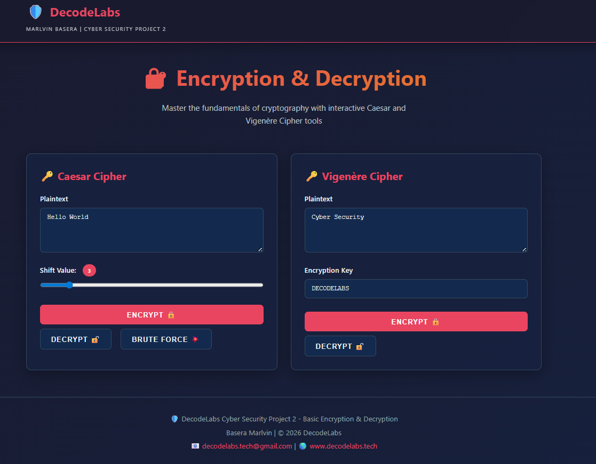
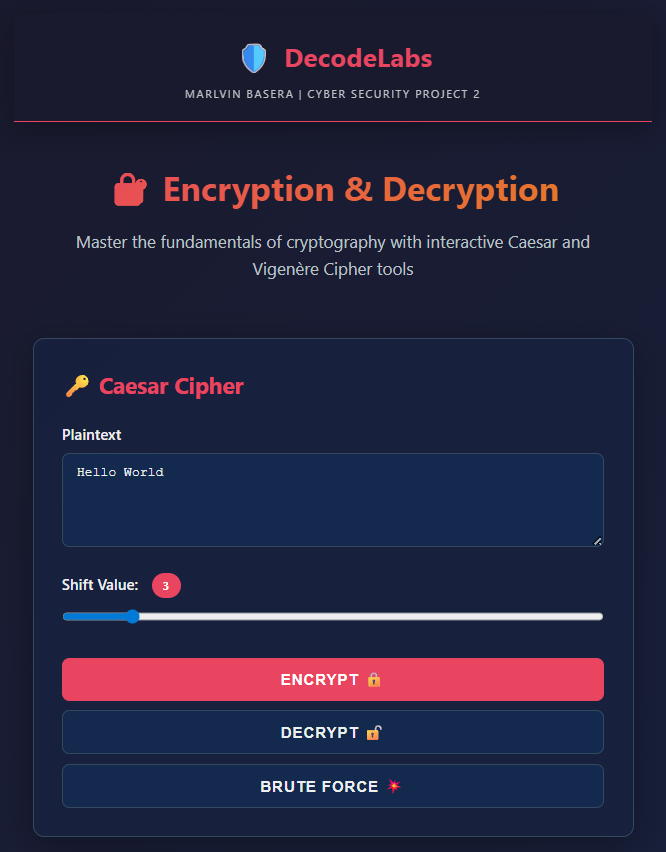
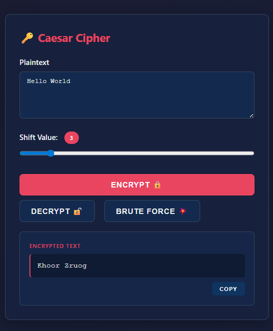
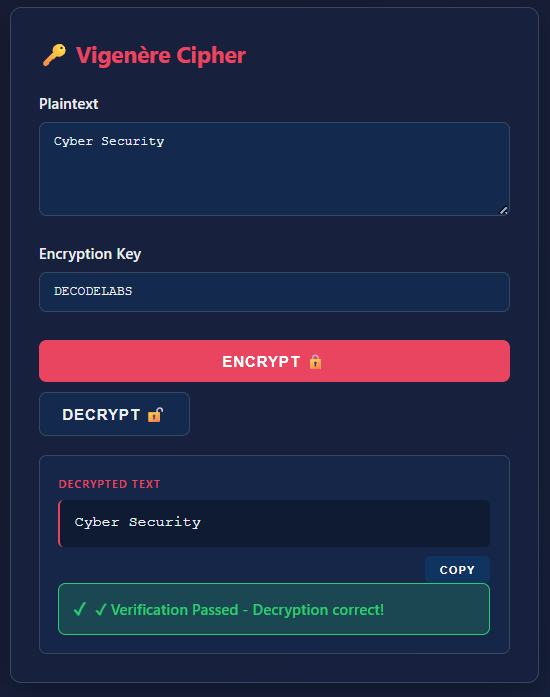

# Classical Cryptography Simulator

An interactive educational simulator for classical cryptography. This application demonstrates key cryptographic concepts through a Python CLI and a fully responsive web-based interface. The project focuses on character-level transformations, key-based polyalphabetic encryption, validation logic, and unit testing.

A live interactive demo can be launched by hosting the static web files on GitHub Pages.

## Table of Contents
- [Overview](#overview)
- [Key Features](#key-features)
- [Technical Architecture and Cipher Math](#technical-architecture-and-cipher-math)
- [Project Structure](#project-structure)
- [Setup and Installation](#setup-and-installation)
- [Usage Guide for Python CLI](#usage-guide-for-python-cli)
- [Usage Guide for Web Interface](#usage-guide-for-web-interface)
- [Visual Previews](#visual-previews)
- [Testing and Verification](#testing-and-verification)
- [Skills Learned & Key Takeaways](#skills-learned--key-takeaways)
- [License](#license)
- [Author](#author)

## Overview
This project was developed under the DecodeLabs Cyber Security Program to showcase the core mathematics and mechanics of classical encryption techniques. By implementing both Caesar and Vigenere ciphers in Python and JavaScript, the project demonstrates how text transformations are executed at the code level, how security keys affect cipher randomness, and how brute force attacks are performed on basic substitution ciphers.

## Key Features
* **Dual Core Implementation**: Matching cryptographic engines written in both Python CLI and Vanilla JavaScript Web UI.
* **Caesar Cipher Engine**: Shifts alphabetical characters dynamically between 0 and 25 while preserving character case, numbers, and symbols.
* **Vigenere Cipher Engine**: Implements key-based polyalphabetic substitution, repeating the keyword sequence to shift characters dynamically.
* **Caesar Brute Force Solver**: Web interface feature that decrypts a message across all 26 shift values to demonstrate cipher vulnerability.
* **Input Validation & Sanitization**: Rejects invalid shifts, non-alphabetic keys, and empty inputs with clear user feedback.
* **Automated Verification Badges**: Instantly check decrypted outputs against original plaintexts to verify mathematical reversibility.
* **Comprehensive Unit Tests**: Python test suite verifying boundary conditions, uppercase/lowercase handling, special characters, and error handling.

## Technical Architecture and Cipher Math

### Caesar Cipher
This is a monoalphabetic substitution cipher where each letter in the plaintext is shifted a fixed number of positions down the alphabet.
* **Encryption Formula**: $E_n(x) = (x + n) \pmod{26}$
* **Decryption Formula**: $D_n(x) = (x - n) \pmod{26}$
*(where $x$ is the letter code between 0 and 25 and $n$ is the shift key)*

### Vigenere Cipher
This uses a keyword where each letter of the keyword represents a different Caesar shift value. The keyword repeats to cover the length of the plaintext.
* **Encryption Formula**: $C_i = (P_i + K_i) \pmod{26}$
* **Decryption Formula**: $P_i = (C_i - K_i) \pmod{26}$
*(where $P_i$ is the plaintext letter, $C_i$ is the ciphertext letter, and $K_i$ is the corresponding key letter shift)*

## Project Structure
```text
Project 2/
├── src/
│   ├── __init__.py
│   ├── ciphers.py         (Caesar and Vigenere core Python math logic)
│   └── main.py            (CLI entry point and menu handler)
├── tests/
│   └── test_ciphers.py    (Python unit test suite)
├── web/
│   ├── index.html         (Main dashboard layout)
│   ├── css/
│   │   └── style.css      (Custom styling and styling layout)
│   ├── js/
│   │   ├── ciphers.js     (JavaScript parity implementation of ciphers)
│   │   └── app.js         (DOM manipulation and tab controller)
│   └── README.md          (Web UI documentation)
├── images/                (Visual assets for GitHub preview)
├── requirements.txt       (Dependency listing)
└── README.md              (Main project documentation)
```

## Setup and Installation
Make sure you have Python 3.6 or higher installed on your system.
1. Clone this repository to your local machine.
2. Navigate to the project folder.
3. No external Python dependencies are required because the project uses the standard library only.

## Usage Guide for Python CLI
To interact with the command line application, open your terminal and run the main script:
```bash
python src/main.py
```
Follow the menu prompts to encrypt and decrypt messages:
* Caesar Cipher mode takes a phrase and a shift value between 0 and 25.
* Vigenere Cipher mode takes a phrase and a letters-only keyword.
The program will output the encrypted ciphertext, decrypt it back, and perform verification checks.

## Usage Guide for Web Interface
To run the web interface, you have two options:
1. Open the file `web/index.html` directly in your web browser.
2. Run a local web server by executing this command:
```bash
python -m http.server 8000
```
After starting the server, open `http://localhost:8000` in your browser.

The web app includes several features:
* Tab switching between Caesar and Vigenere ciphers.
* Brute Force decryption showing all possible shifts.
* Copy button for quick clipboard copying.

For more details on the web components, styling, and troubleshooting, refer to the [Web Interface README](web/README.md).

## Visual Previews

Here is a visual showcase of the simulator interface and cipher tools:

<table width="100%">
  <tr>
    <td width="50%" align="center">
      
      <br />
      <b>Main Dashboard Interface</b>
    </td>
    <td width="50%" align="center">
      
      <br />
      <b>Mobile Responsive View</b>
    </td>
  </tr>
  <tr>
    <td width="50%" align="center">
      
      <br />
      <b>Caesar Cipher Encryption & Brute Force</b>
    </td>
    <td width="50%" align="center">
      
      <br />
      <b>Vigenere Cipher Decryption</b>
    </td>
  </tr>
</table>

## Testing and Verification
A robust test suite is included to ensure mathematical parity between operations and prevent regression. Run the automated Python unit tests with this command:
```bash
python tests/test_ciphers.py
```
The test runner validates standard alphanumeric shifting, case preservation, exclusion of special characters, zero shift values, and error handling.

## Skills Learned & Key Takeaways

### 🛡️ Cryptography & Cybersecurity Concepts
* **Understanding Key Space & Entropy**: Learned how the security of a cipher relies on its key space. Caesar ciphers are highly vulnerable to brute-force attacks due to having only 26 possible shift keys.
* **Frequency Analysis**: Studied how monoalphabetic substitution ciphers fail to hide language patterns because the statistical distribution of letters remains unchanged in the ciphertext.
* **Polyalphabetic Substitution**: Implemented Vigenère's repeating-keyword mechanism to dynamically shift characters, effectively flattening letter frequency distributions to resist basic frequency analysis.
* **Modern Cryptographic Foundations**: Explored how ancient concepts of substitution and transposition serve as the building blocks for modern symmetric encryption algorithms (like AES).

### 💻 Software Engineering & Implementation Skills
* **Cross-Language Parity**: Designed and implemented identical cryptographic logic across two different languages and runtime environments (Python CLI and Vanilla JavaScript Browser UI).
* **Robust Input Sanitization**: Implemented strict validation checks for edge cases such as empty values, invalid numeric bounds, and non-alphabetic keys with clear error messages.
* **Automated Unit Testing**: Wrote comprehensive unit tests in Python using the `unittest` library to systematically verify cipher boundary conditions, case preservation, and exceptional states.
* **Vanilla Web Development**: Created a clean, responsive single-page web dashboard using pure HTML, CSS variables, and native DOM manipulation without relying on external libraries.

## License
This project is licensed under the MIT License.

## Author
Marlvin Basera